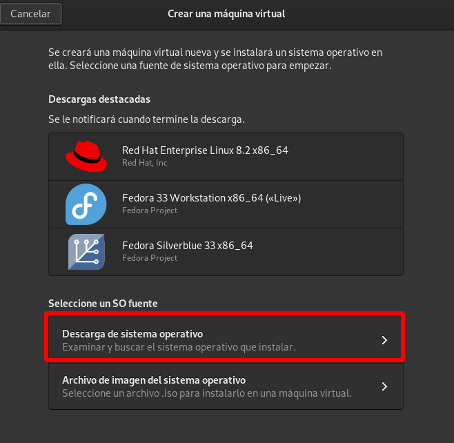
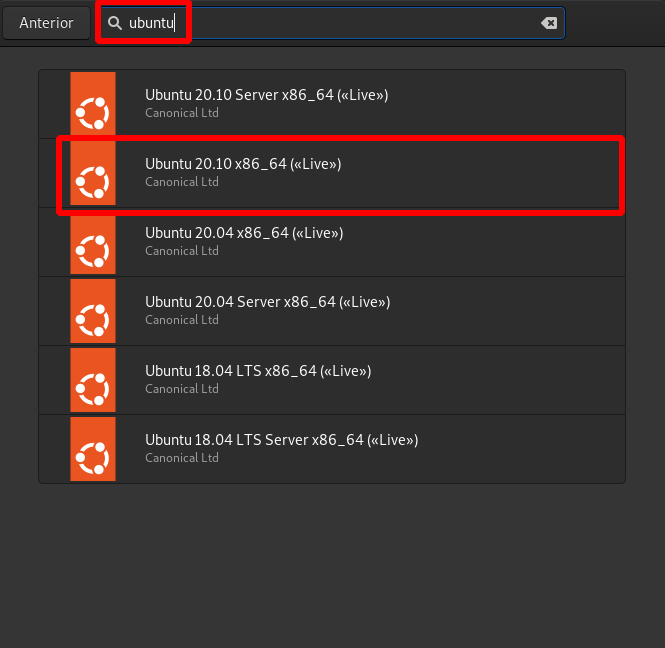
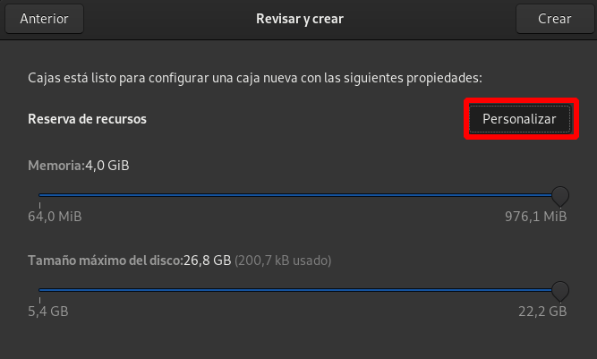
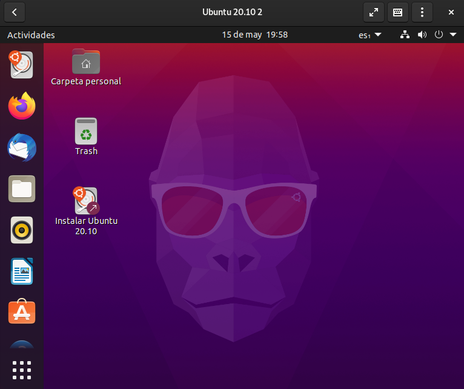
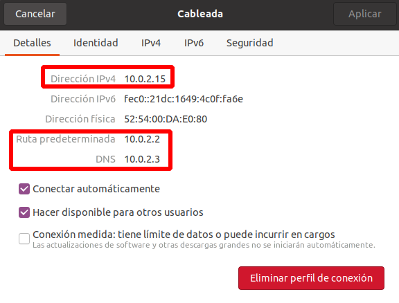

# Conexión local no privilegiada a libvirt

Como hemos comentado en el punto anterior, un usuario sin privilegio puede crear sus máquinas virtuales. Para ello realizará una conexión local a la URI `qemu:///session`. En este modo de conexión, el usuario no tiene permisos para crear conexiones de red, por lo que se limita su uso de la red no privilegiada de qemu ([SLIRP](https://wiki.qemu.org/Documentation/Networking#User_Networking_.28SLIRP.29)) que es útil para casos simples, pero que tiene bajo rendimiento y es poco configurable. 

El usuario podría usar cualquier aplicación que nos permite la creación de máquinas virtuales (`virsh`, `virt-install`, `virt-manager`,...), pero en este apartado vamos a usar **Gnome Cajas** ([Gnome Boxes](https://wiki.gnome.org/Apps/Boxes)), que es una aplicación gráfica que nos permite crear máquinas virtuales, de forma sencilla, en el espacio de usuario.

## Gnome Boxes

Instalamos esta aplicación:

```
# apt install gnome-boxes
```

La utilización de esta aplicación es muy sencilla. Podemos descargar distribuciones Linux preconfiguradas o elegir un fichero ISO para realizar la instalación. Siguiendo la [documentación](https://help.gnome.org/users/gnome-boxes/stable/index.html.es) de la aplicación, seguimos los siguientes pasos para crear una nueva maquina virtual:

Pulsamos el botón "+" y elegimos la opción **Crea una máquina virtual...**. A continuación podemos escoger un sistema predefinido o un fichero ISO para realizar la instalación. Elegimos un sistema preconfigurado:



A continuación buscamos las versiones de Ubuntu:



Después de la descarga, configuramos la nueva máquina:



Y al terminar la instalación  podemos acceder a la máquina:



La máquina se conecta a la red de usuario de QEMU ([SLIRP](https://wiki.qemu.org/Documentation/Networking#User_Networking_.28SLIRP.29)) que configura la máquina con la dirección IP `10.0.2.15`, su puerta de enlace, que es el anfitrión (la máquina física) es la dirección IP `10.0.2.2` y configura un servidor DNS en la dirección IP `10.0.2.3`. Esta red permite que la máquina tenga acceso a internet, pero no tendrá conectividad con el anfitrión u otras máquinas que creemos.



## Acceso a las máquinas desde la línea de comandos

Para comprobar que la máquina virtual que hemos creado está virtualizada con QEMU/KVM + libvirt en el espacio de usuario, podemos ejecutar en el anfitrión con el usuario con el que estamos trabajando:

```
usuario@kvm:~$ virsh -c qemu:///session list
 Id   Nombre          Estado
----------------------------------
 2    ubuntu20.10-2   ejecutando
```

Vemos que la máquina está creado en la sesión del usuario `usuario`. **Nota: No es necesario indicar la conexión `-c qemu:///session`, pero de esa forma se ve más claro que estamos haciendo una conexión local con un usuario sin privilegios**.

Por último, indicar que la imagen del disco se guarda por defecto en el directorio `~/.local/share/gnome-boxes/images`:

```
usuario@kvm:~$ ls -l .local/share/gnome-boxes/images
total 196
-rwxr--r-- 1 usuario usuario 196816 may 15 21:52 ubuntu20.10-2
```

---

[Índice](https://github.com/josedom24/curso_virtualizacion_linux)

