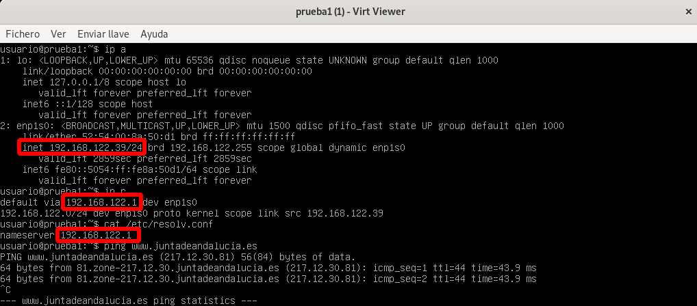
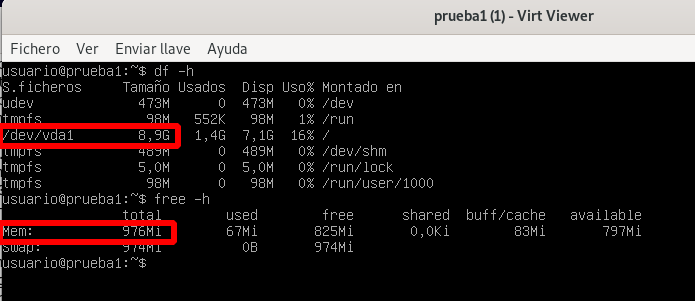

# Características de las máquinas virtuales

Después de instalar nuestra primera máquina, podemos comprobar la lista de máquinas ejecutando la siguiente instrucción:

```
virsh -c qemu:///system list
 Id   Nombre    Estado
----------------------------
 2    prueba1   ejecutando
```

Si queremos acceder a la terminal de una máquina podemos usar `virt-view` de la siguiente forma:

```
virt-viewer -c qemu:///system prueba1
```

## Red

Como comentábamos en el punto anterior, la máquina que hemos creado se conecta, por defcto, a la red `default`. Esta red es de tipo NAT, y comprobamos que la máquina ha recibido una IP de forma dinámica y que su puerta de enlace corresponde a la dirección IP `192.168.122.1`, que corresponde con el host, el servidor DNS corresponde a la misma IP y comprobamos que tiene resolución y acceso a internet:



## Recursos hardware

Podemos comprobar que la maqúina tiene un disco de 10 Gb y de memoria RAM 1Gb:



## Almacenamiento

Un **Pool de almacenamiento** es un recurso de almacenamiento. Lo más usual es tener pools de almacenamiento que sean locales, por ejemplo un directorio. En el momento de crear la primera máquina se han creado dos pools de almacenamiento de tipo *dir* y que corresponden a los dos directorios con los que estamos trabajando:

* `default`: Es un pool de almacenamiento que corresponde con el directorio `/usr/lib/libvirt/images` y donde se guardarán los ficheros correspondientes a las imágenes de disco.
* `iso`: Este pool de almacenamiento se ha creado al indicar en `virt-install`el directorio donde estaba almacenado el fichero ISO. En este caso es otro pool de almacenamiento de tipo *dir*, y corresponde al directorio `~/ISO`.

Podemos ver los pools de almacenamiento, que tenemos creado, ejecutando:

```
virsh -c qemu:///system pool-list 
 Nombre    Estado   Inicio automático
---------------------------------------
 default   activo   si
 iso       activo   si
```

Un **volumen** es un medio de almacenamiento que podemos crear en un pool de almacenamiento en kvm. Si el pool de almacenamiento es de tipo *dir*, entonces el volumen será un fichero de imagen.

Veamos el volumen que se ha creado el pool `default`:

```
virsh -c qemu:///system vol-list default
 Nombre          Ruta
--------------------------------------------------------
 prueba1.qcow2   /var/lib/libvirt/images/prueba1.qcow2
```

Vemos que la imagen del disco de la máquina virtual está guardada en un fichero QCOW2. También podemos ver el volumen que está creado en el pool `iso`:

```
virsh -c qemu:///system vol-list iso
 Nombre                            Ruta
--------------------------------------------------------------------------------------
 debian-11.3.0-amd64-netinst.iso   /home/usuario/iso/debian-11.3.0-amd64-netinst.iso
```

Que corresponde al fichero de la imagen ISO que hemos copiado en el directorio `~/ISO`.

En todos estos conceptos sobre almacenamiento profundizaremos en el módulo correspondiente.

---

[Índice](https://github.com/josedom24/curso_virtualizacion_linux)
