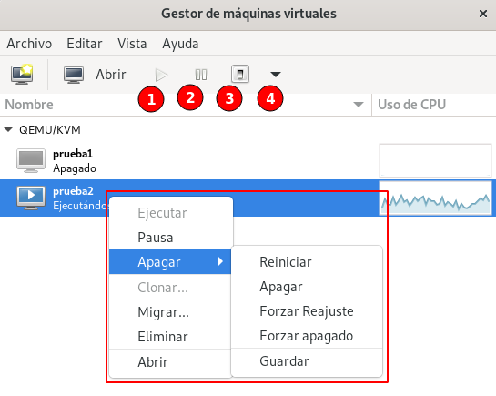

# Gestión de máquinas virtuales

Para elegir las distintas opciones que tenemos para gestionar nuestras máquinas, pulsamos sobre el botón derecho en la máquina:

* **Ejecutar**: Si la máquina está parada, la inicia. También podemos usar el **botón 1 del menú**.
* **Pausa**: Pausa la ejecución de la máquina virtual. Podremos reanudar la ejecución con la opción **Reanudar**. También podemos usar el **botón 2 del menú**.
* **Apagar**: En este menú tenemos varias opciones (todas estas opciones también se pueden elegir en el **botón 4 del menú**):
	* **Reiniciar**: Reinicia la máquina.
	* **Apagar**: Apaga la máquina. También podemos usar el **botón 3 del menú**.
	* **Forzar Reajuste**: Apaga la máquina simulando que se pulsa el botón **reset**.
	* **Forzar apagado**: Fuerza el apagado de la máquina.
	* **Guardar**: Guarda el estado de la máquina en memoria. Para recuperar la máquina escogemos la opción **Reanudar**.
* **Clonar**: Crea una nueva máquina a partir de esta.
* **Migrar**: Nos permite trasladar la máquina a otra máquina que este ejecutando QEMU/KVM.
* **Eliminar**: Elimina la definición de la máquina. Nos da la opción de eliminar el volumen de disco asociado.
* **Abrir**: Abre el "Detalle de la máquina". esta opción también se puede escoger desde el botón **Abrir**, o desde la opción del menú **Editar -> Detalles de la máquina virtual**. Esta opción la estudiaremos en el siguiente punto.
