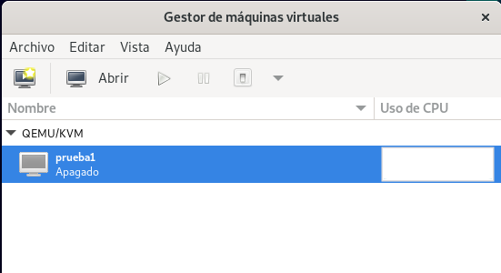
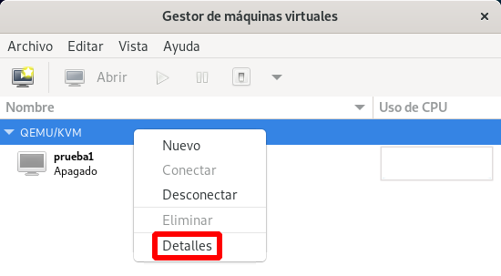
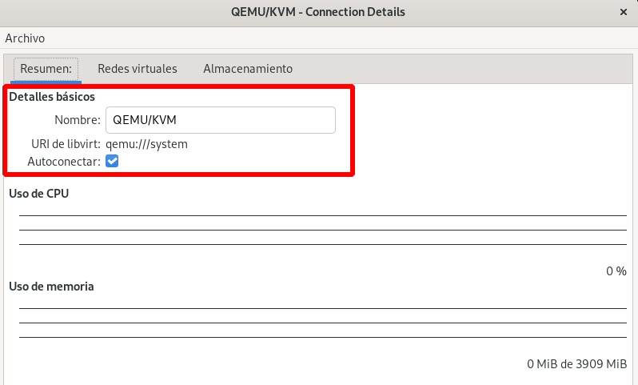
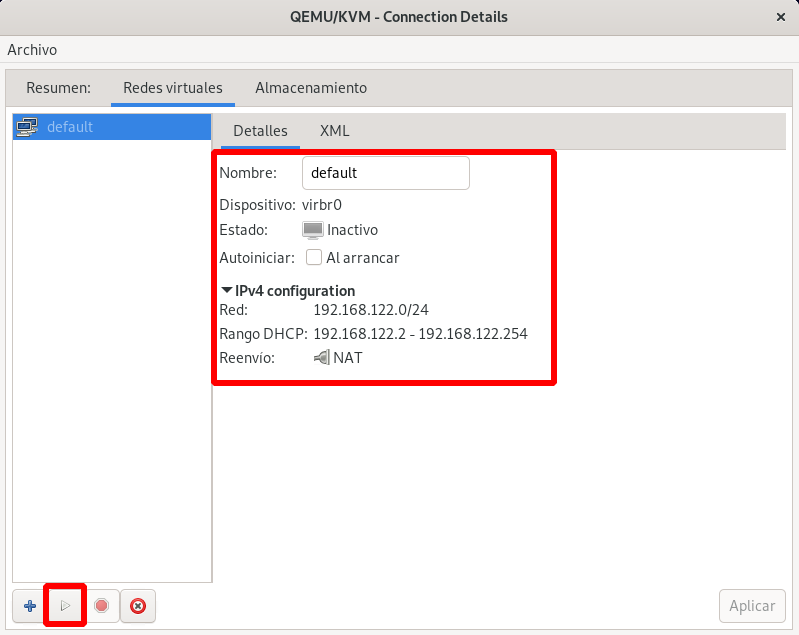
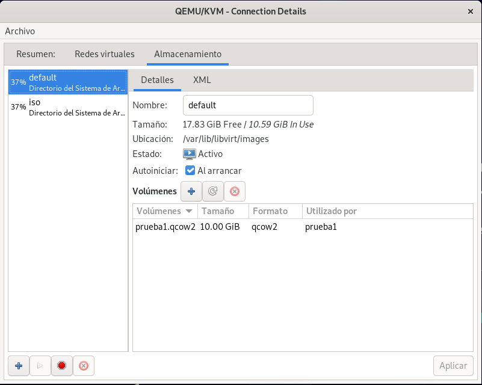
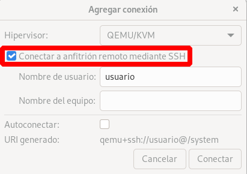

# Primeros pasos con virt-manager

[virt-manager](https://virt-manager.org/) es una aplicación gráfica de escritorio para gestionar máquinas virtuales a través de libvirt. Presenta una vista resumida de las máquinas virtuales en ejecución, su rendimiento en vivo y las estadísticas de utilización de recursos. Los usuarios pueden crear nuevas máquinas virtuales y configurarlas y gestionar sus dispositivos de hardware. Además, poseer un cliente VNC / SPICE que permite el acceso de forma sencilla a la consola de la máquina.

## Instalación de virt-manager

En sistemas operativos basados en Debian / Ubuntu, simplemente ejecutamos:

```
apt install virt-manager
```

## Vista general de virt-manager



Pode defecto, podemos ver que virt-manager tiene configurado una conexión local privilegiada que se llama **QEMU/KVM**. Vemos las máquinas virtuales que están creada en esa conexión (en este caso `prueba1`, que creamos en el módulo anterior).

Con la opción **Archivo->Nueva conexión...** podemos dar de alta una nueva conexión.

## Conexión QEMU/KVM

Si pulsamos con el botón derecho del ratón sobre la conexión QEMU/KVM, además de distintas opciones, como *Nueva*, *Desconectar*,..., encontramos la opción **Detalles** (esta opción también se puede elegir en el menú **Editar -> Detalle de la conexión**):



Al elegir el detalle de la conexión, podemos comprobar que es una conexión local privilegiada. Nos conectamos a la URI `qemu:///system`. Además está configurada para que se conecte de forma automática cada vez que iniciamos la aplicación:



### Redes disponibles

También podemos gestionar las redes de esta conexión. Podemos ver las redes creadas, crear nuevas redes, eliminarlas, modificarlas, ... Vemos que tenemos creada la red `default` y ver sus características (tipo NAT, configuración ofrecida por un servidor  DHCP, Linux Bridge que gestiona,...). Por defecto está inactiva, para activarla, la seleccionamos y pulsamos sobre el botón ▶.



### Pools de almacenamiento disponibles

Otro elemento que podemos gestionar son los Pool de almacenamiento que tenemos en la conexión. Recordamos que teníamos dos creados: el pool `default`, donde se guardaban las imágenes de discos, y el pool `iso`, donde almacenamos los ficheros ISO para las instalaciones de los sistemas operativos. Además, podemos ver los volúmenes (en este caso, los ficheros) que hay creados en cada pool.



## Conexión remota con virt-manager

Si quisiéramos conectarnos de forma remota a un servidor donde se está ejecutando libvirt, podríamos crear una nueva conexión: **Archivo -> Añadir conexión...**, y crear una conexión y elegir la opción **Conectar a anfitrión mediante SSH**:



## Conclusión

`virt-manager` es otra aplicación que nos permite hacer conexiones a libvirt, como hacemos con la aplicación `virsh` o `virt-install`. Por lo tanto, los recursos virtualizados que gestionamos con estas aplicaciones cuando nos conectamos a `qemu:///system` son los mismos. Los cambios que hagamos con una aplicación se ven reflejados en cualquiera de las otras. `virt-manager` es más fácil de usar, pero nos ofrece menos opciones que la aplicación `virsh` o `virt-install`.
