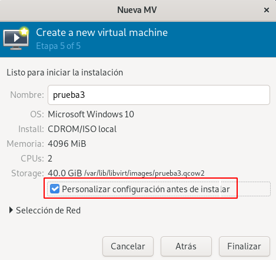
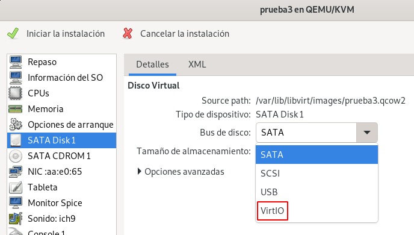
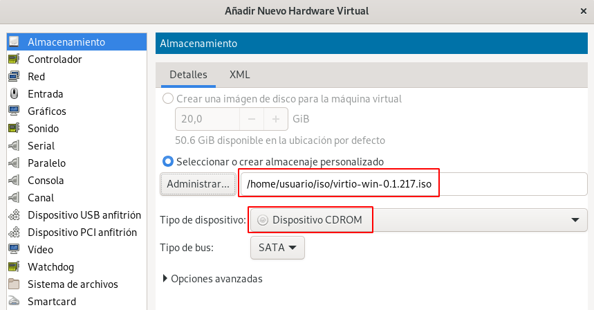
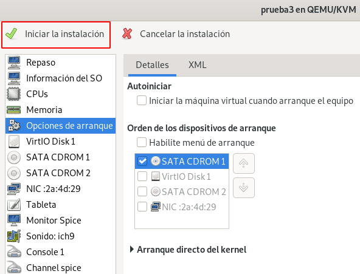
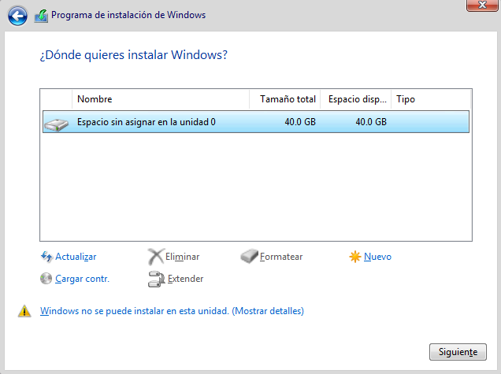

# Creación de máquinas virtuales Windows

En un apartado anterior hemos visto los pasos fundamentales para la creación de una máquina virtual Linux. Para crear una máquina virtual con un sistema operativo tipo Windows se siguen los mismos pasos, pero tenemos que tener en cuenta que Windows no tiene soporte nativo para dispositivos VirtIO. Por lo tanto, a la hora de crear una máquina virtual Windows tendremos que añadir los controladores de dispositivos (drivers) necesarios para que Windows identifique los dispositivos VirtIO que definamos en la máquina virtual.

En este caso, el proyecto Fedora proporciona controladores de dispositivos de software libre para VirtIO en Windows.

## ISO de los controladores de dispositivo VirtIO para Windows

Podemos bajar la última versión de los drivers VirtIO para Windows en el siguiente [enlace](https://fedorapeople.org/groups/virt/virtio-win/direct-downloads/stable-virtio/virtio-win.iso) y copiar la ISO al pool de almacenamiento ISO, es decir, en el directorio `~/iso`. También hemos copiado a ese directorio una ISO para la instalación de Windows 10.


Creamos la nueva máquina virtual Windows

Teniendo en cuenta los siguiente:

* Elegimos una imagen ISO para instalar una versión de Windows y seleccionamos la variante del sistema operativo que estamos instalando.
* Configuramos la CPU y la RAM para tener recursos suficientes.
* Como estamos instalando un sistema operativo Windows, *virt-manager* va a configurar los dispositivos para que sean compatibles con el sistema operativo. En concreto, el driver del disco y de la tarjeta de red no serán VirtIO, con lo que no conseguiremos el rendimiento adecuado. Por lo tanto, antes de realizar la instalación vamos a cambiar el tipo de driver de estos dispositivos, escogiendo **VirtIO** para obtener el máximo de rendimiento. 

En la pantalla final del asistente de creación de la máquina virtual, escogeremos la opción **Personalizar la configuración antes de instalar**:



## Elegimos dispositivos VirtIO

El primer cambio será elegir el driver VirtIO para el disco. Como observamos se ha configurado con el driver SATA, que será compatible con Windows, pero al ser un dispositivo emulado, nos dará menos rendimiento. Escogemos la opción **VirtIO**, y pulsamos en el botón **Aplicar**:



A continuación, cambiamos el driver de la tarjeta de red. Del mismo modo, observamos que ha escogido un modelo *e1000e*, compatible con Windows, pero del mismo modo nos ofrece menos rendimiento que la opción **VirtIO**. cuando hagamos el cambio, volvemos a pulsar sobre el botón **Aplicar**. **Nota: Como hemos comentado Windows no es compatible con este modelo de tarjeta de red, por lo que durante la instalación no tendremos conexión a internet. Si necesitamos tener conexión, podríamos dejar el modelo escogido por defecto, y posteriormente modificar la configuración de la tarjeta.**


## Añadimos un CDROM con los drivers VirtIO

Antes de iniciar la máquina, le añadimos un CD-ROM con la imagen ISO de los drivers VirtIO. Para ello, pulsamos el botón **Agregar Hardware**, y añadimos un nuevo dispositivo de almacenamiento:



Además, nos tenemos que asegurar que en el orden de arranque el CDROM donde hemos montado la ISO de Windows esté por delante que el CDROM con los drivers VirtIO, y sea la primera opción. Una vez terminado pulsamos el botón **Aplicar** y el botón **Iniciar la instalación** para comenzar la instalación.



## Comenzamos la instalación

Iniciamos la máquina, accedemos a la consola y comenzamos la instalación, hasta que llegamos a la pantalla donde tenemos que escoger el disco duro donde vamos a realizar la instalación.


Como vemos no se puede detectar el disco duro, ya que Windows no puede reconocer inicialmente el controlador VirtIO. Vamos a cargar los controladores de dispositivo VirtIO que necesitamos del CDROM que hemos montado:

Elegimos la opción *Cargar contr.*, le damos a *Examinar* y elegimos del CDROM donde tenemos los drivers VirtIO la carpeta de nuestra arquitectura (*amd64*) y la versión de Windows.


Y ya podemos continuar con la instalación de Windows porque ya detecta el disco duro:



## Configuración de la red

Como indicábamos anteriormente, también hemos escogido el controlador VirtIO para la tarjeta de red. Una vez realizada la configuración tendremos que instalar los drivers adecuados para que funcione la tarjeta de red. Para ello, actualizamos el controlador del dispositivo **Controladora Ethernet** en el **Administrador de dispositivos**:


Y escogemos la carpeta del CDROM donde hemos montado los drivers VirtIO: `NetKVM\<carpeta con el nombre de tu versión de windows>\amd64`:


## Creación de una máquina virtual Windos con virt-install

Si queremos crear con `virt-install` una máquina virtual para la instalación de Windows con la misma configuración que hemos visto anteriormente, podemos ejecutar la siguiente instrucción:

```
virt-install --connect qemu:///system \
			 --virt-type kvm \
			 --name prueba4 \
			 --cdrom ~/iso/Win10_21H2_Spanish_x64.iso \
			 --os-variant win10 \
			 --disk size=40,bus=virtio \
			 --disk ~/iso/virtio-win-0.1.217.iso,device=cdrom \
			 --network=default,model=virtio \
			 --memory 2048 \
			 --vcpus 2
```

Tenemos que tener en cuanta algunas cosas nuevas que hemos introducido:

* `--disk size=40,bus=virtio`: En la declaración del disco indicamos el controlador VirtIO.
* `--disk ~/iso/virtio-win-0.1.217.iso,device=cdrom`: El segundo CDROM se indica con el parámetro `disk` indicando `device=cdrom`.
* `--network=default,model=virtio`: De la misma manera, indicamos el modelo de tarjeta de red como VirtIO.
