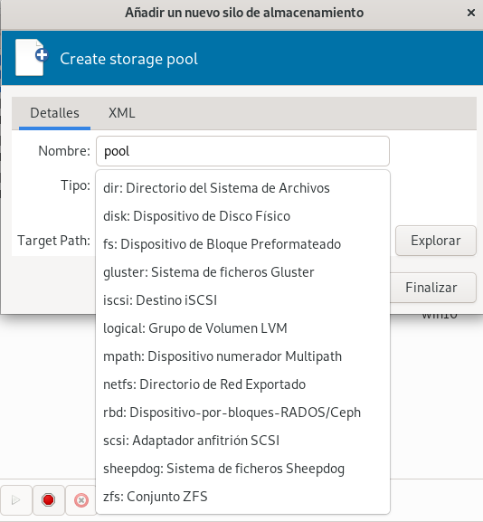

# Introducción al almacenamiento en QEMU/KVM + libvirt

## Introducción al almacenamiento

Libvirt proporciona la gestión del almacenamiento a través de **pools de almacenamiento** y **volúmenes**.

* **Pools de Almacenamiento**: Es una fuente de almacenamiento, una cantidad de almacenamiento que el administrador del host ha configurado para su uso por las máquinas virtuales.
* **Volúmenes**: Los pools de almacenamiento se dividen en volúmenes. Cada uno de estos volúmenes lo utilizaran las máquinas virtuales como discos (dispositivos de bloques).

## Tipos de Pools de Almacenamiento

QEMU/KVM + libvirt puede trabajar con distintas fuentes y tecnologías de almacenamiento que nos ofrecerán distintas características:

* **dir**: Nos ofrece un directorio del host (por lo tanto, nos ofrece un sistema de archivo). Este tipo no nos ofrece la característica de almacenamiento compartido. Los discos de las máquinas virtuales se guardaran en ficheros de imagen de disco. Tenemos distintos formatos de ficheros de imágenes:
	* **raw**: el formato raw es una imagen binaria sencilla de la imagen del disco. Se ocupa todo el espacio que hayamos indicado al crearla. El acceso es más eficiente. No soporta ni snapshots ni aprovisionamiento ligero.
    * **qcow2**: formato QEMU copy-on-write. Al crearse sólo se ocupa el espacio que se está ocupando con los datos (aprovisionamiento ligero), el fichero irá creciendo cuando escribamos en el él. Acepta instantáneas o snapshots. Es menos eficiente en cuanto al acceso.
    * **vdi, vmdk,...**: formatos de otros sistemas de virtualización.

	En un Pool de Almacenamiento de tipo **dir**, los **volúmenes** son ficheros de imágenes de disco. Los Pools de Almacenamiento con lo que hemos trabajado hasta ahora (`default` y `iso`) son de este tipo.

* **logical**: En este caso, utilizamos LVM (Logical Volume Manager). El Pool de Almacenamiento controlará un **Grupo de Volúmenes**, y los **volúmenes** (los discos de las máquinas virtuales) serán **volúmenes lógicos** que se crearán en el grupo de volúmenes. Este tipo de almacenamiento no ofrece almacenamiento compartido.
* **netfs**: Este tipo de Pool de Almacenamiento montará un directorio desde un servidor NAS (nfs, glusterfs, cifs,...). Por lo tanto obtendremos la característica de compartición y de migración en vivo. Los **volúmenes** serán ficheros de imágenes de disco.
* **iSCSI**: Este tipo de Pool de Almacenamiento montará un disco desde un servidor SAN de tipo iSCSI. Obtendremos la característica de almacenamiento compartido a nivel de disco con las consideraciones que vimos en el punto anterior.
* [Muchos más...](https://libvirt.org/storage.html)

## Gestión de volúmenes de almacenamiento

Los volúmenes son los medios de medios de almacenamiento que utilizarán las máquinas virtuales. Un Pool de Almacenamiento estará formado por volúmenes. Dependiendo del tipo del pool, el volumen corresponderá a un medio de almacenamiento determinado. Veamos un ejemplo:

* Si el tipo del pool es **dir**, es decir, un directorio del sistema de fichero del host, el volumen corresponde a un fichero (el fichero que contiene la imagen del disco).
* Si el tipo del pool es **logical**, es decir, gestiona un grupo de volúmenes LVM, el volumen corresponderá a un volumen lógico LVM.

Por lo tanto tenemos dos enfoques para crear los volúmenes:

* Usar **la API de libvirt**, es decir, usar herramientas como `virsh` o `virt-manager` para gestionar los volúmenes. En este caso, si creamos un volumen en un pool de tipo **dir**, estaríamos creando un fichero de imagen de disco. Del mismo modo, si lo creamos en un pool de tipo **logical** estaríamos creando un volumen lógico LVM.
* Utilizar herramientas específicas para crear los medios de almacenamiento y posteriormente **refrescar** el pool para que añada el nuevo volumen. Ejemplo: podemos usar la herramienta `qemu-img` para la creación de un fichero de imagen de disco y posteriormente actualizaremos el pool de tipo **dir** para añadir el nuevo volumen que corresponde al fichero que hemos creado. Otro ejemplo: usar la línea de comandos de LVM, creando un volumen lógico con el comando `lvcreate` y posteriormente actualizamos el pool de tipo **logical** para añadir el nuevo volumen.

Si estamos trabajando localmente en un servidor donde tenemos QEMU/KVM + libvirt instalado, no hay muchas diferencias de usar una y otra opción. El uso de la API de libvirt puede ser más interesante si estamos conectados a la API de libvirt de forma remota, ya que al gestionar los volúmenes estaríamos gestionando los recursos de almacenamiento (ficheros, volúmenes lógicos,...) sin necesidad de acceder al servidor y crearlos con herramientas específicas.

## Conclusiones

Tenemos la posibilidad de crear distintos tipos de Pools de Almacenamiento, que nos ofrecen distintas características. Podemos ver los distintos tipos al crear un Pool desde `virt-manager`:

En este curso vamos a trabajar con los Pool de Almacenamiento de tipo **dir**. Si quieres profundizar en las características de los distintos tipos de almacenamiento puedes ver la documentación oficial: [Storage Management](https://libvirt.org/storage.html).
