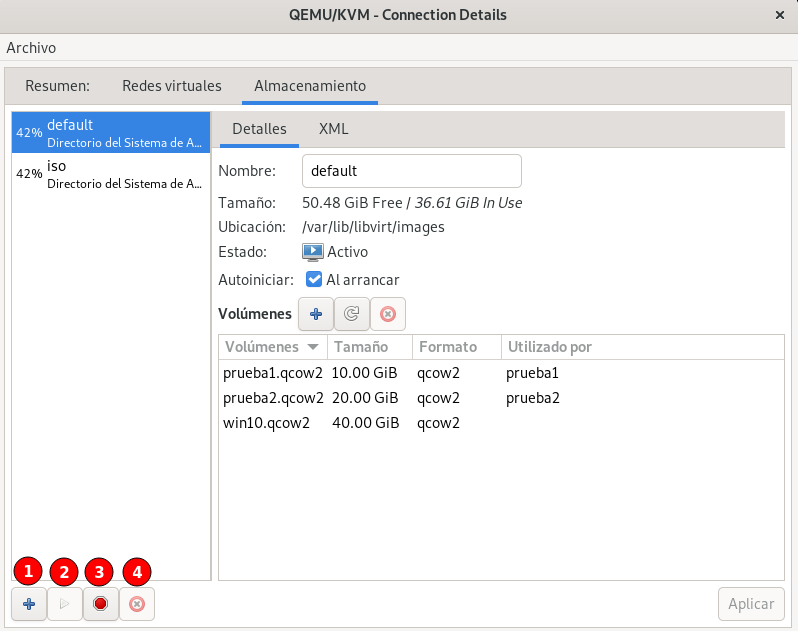
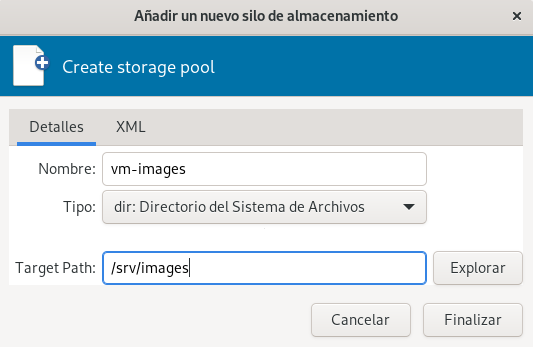
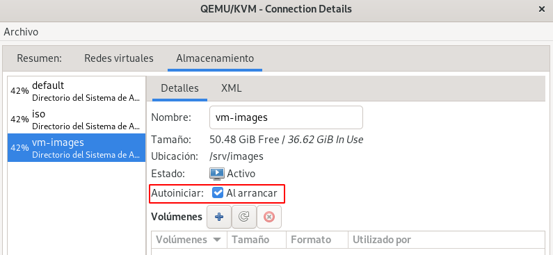
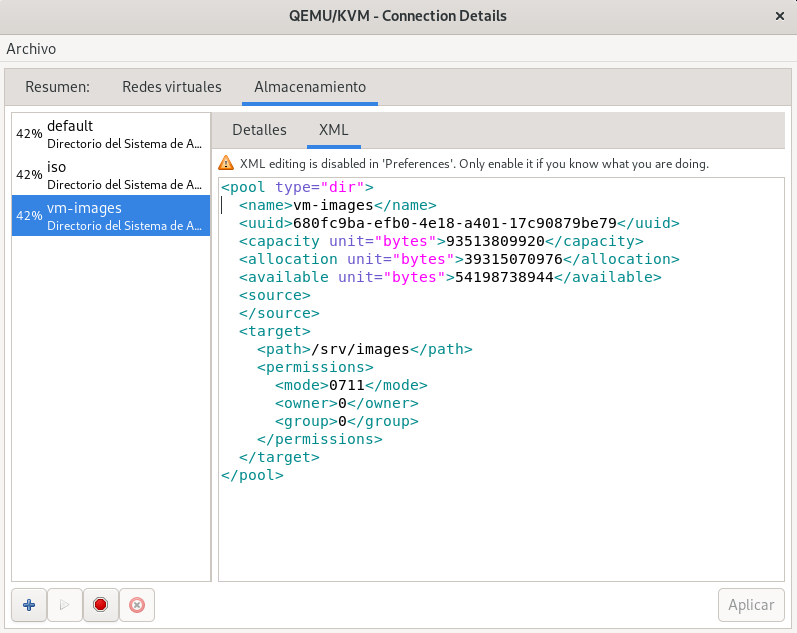

# Gestión de Pools de Almacenamiento

## Gestión de Pools de Almacenamiento con virsh

Como hemos visto durante este curso tenemos a nuestra disposición dos Pool de Almacenamiento, para ver los pools con la herramienta `virsh`, ejecutamos la siguiente instrucción:

```
virsh -c qemu:///system pool-list 
 Nombre    Estado   Inicio automático
---------------------------------------
 default   activo   si
 iso       activo   si
```

Recuerda que el pool por defecto donde se guardan las imágenes de disco, es `default`. Podemos obtener información de ese pool con la instrucción:

```
virsh -c qemu:///system pool-info default 
Nombre:         default
UUID:           0a03e05b-8844-4029-8216-430fc289fe8f
Estado:         ejecutando
Persistente:    si
Autoinicio:     si
Capacidad:      87,09 GiB
Ubicación:     36,61 GiB
Disponible:     50,48 GiB
```

Al igual que las máquinas virtuales, los Pools de Almacenamiento se definen por un documento XML. Para ver la definición XML del pool `default` podemos ejecutar `virsh -c qemu:///system pool-dumpxml default`. A partir de un fichero XML con la definición de un nuevo pool, podríamos crearlo con el subcomando `virsh pool-define`. 

**Nota: Para profundizar en el formato XML que define los Pools de Almacenamiento puedes consultar la documentación oficial: [Storage pool and volume XML format](https://libvirt.org/formatstorage.html).**

Sin embargo, vamos a usar otro comando que nos permite indicar la información del nuevo pool por medio de parámetros. Vamos a crear un nuevo pool que vamos a llamar `mv-images`, de tipo **dir** y cuyo directorio será `/srv/images`. Supongamos que hemos añadido más almacenamiento al host y que hemos montado el disco en el directorio `/srv/images` y queremos guardar las imágenes de disco en esa nueva localización. Para crear el nuevo pool, de forma persistente ejecutamos:

```
virsh -c qemu:///system pool-define-as vm-images dir --target /srv/images
El grupo vm-images ha sido definido
```

**Nota: Si utilizamos `pool-create` o `pool-create-as`, el pool se crea temporalmente, no será persistente y después de un reinicio del host no existirá.**

A continuación creamos el directorio indicado, con la instrucción:

```
virsh -c qemu:///system pool-build vm-images 
El pool vm-images ha sido compilado
```

Ahora debemos iniciar el pool:

```
virsh -c qemu:///system pool-start vm-images 
Se ha iniciado el grupo vm-images
```

Y si lo deseamos lo podemos auto iniciar, para que en el reinicio del host vuelva a estar activo:

```
virsh -c qemu:///system pool-autostart vm-images 
Se ha iniciado el grupo vm-images
```

Finalmente vemos la lista de pool y pedimos información del nuevo pool:

```
virsh -c qemu:///system pool-list
 Nombre      Estado   Inicio automático
-----------------------------------------
 default     activo   si
 iso         activo   si
 vm-images   activo   si

virsh -c qemu:///system pool-info vm-images 
Nombre:         vm-images
UUID:           a9eb290a-9973-47ea-b616-0907a5df8ea2
Estado:         ejecutando
Persistente:    si
Autoinicio:     si
...
```

Ya podemos usar este pool de almacenamiento para guardar ficheros de imágenes de disco. Si en algún momento queremos eliminarlo, es recomendable pararlo:

```
virsh -c qemu:///system pool-destroy vm-images 
El grupo vm-images ha sido destruid
```

A continuación, opcionalmente, podemos borrar el directorio creado:

```
virsh -c qemu:///system pool-delete vm-images 
El grupo vm-images ha sido eliminado
```

Y por último lo eliminamos:

```
virsh -c qemu:///system pool-undefine vm-images 
Se ha quitado la definición del grupo vm-images
```
## Gestión de Pools de Almacenamiento con virt-amanger

Desde la pestaña **Almacenamiento** de los **Detalles de la conexión** podemos ver los pools que tenemos creados y podemos gestionarlos:



Tenemos las siguientes opciones:

* **Botón 1**: Añadir un nuevo pool.
* **Botón 2**: Iniciar el pool seleccionado.
* **Botón 3**: Parar el pool seleccionado.
* **Botón 4**: Eliminar el pool seleccionado.

Si creamos un nuevo pool, vemos la siguiente pantalla donde indicamos el nombre, el tipo y en el caso del tipo **dir**, el directorio:



Una vez creado, observamos que está iniciado y que tiene marcada como activa la propiedad de autoiniciar:



Por último, recordar que desde `virt-manager` podemos ver la definición XML de los recursos con los que trabajamos:



