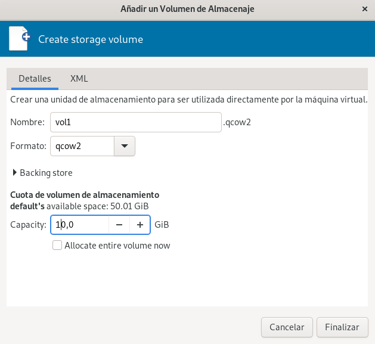

# Gestión de volúmenes de almacenamiento con libvirt

En este apartado vamos a estudiar la gestión de volúmenes de almacenamiento usando la API de libvirt, por lo tanto, utilizando herramientas como `virsh` o `virt-manager`. 

Vamos a trabajar con los Pool de Almacenamiento que hemos creado que son de tipo **dir**, por lo tanto los volúmenes corresponden a ficheros de imágenes de disco. Para estos ejemplos, utilizaremos el formato de imagen **qcow2**.

## Gestión de volúmenes de almacenamiento con virsh

Para obtener los volúmenes de un determinado pool (por ejemplo el pool `default`), ejecutamos:

```
virsh -c qemu:///system vol-list default
 Nombre            Ruta
------------------------------------------------------------
 prueba1.qcow2   /var/lib/libvirt/images/prueba1.qcow2
 prueba2.qcow2   /var/lib/libvirt/images/prueba2.qcow2
 win10.qcow2     /var/lib/libvirt/images/win10.qcow2
```

Podemos comprobar que los volúmenes listados se corresponden con ficheros que se encuentran en el directorio del pool `default` (`/var/lib/libvirt/images`).

Al estar utilizando el formato de imagen `qcow2`, obtenemos la característica de aprovisionamiento ligero, el fichero tiene un tamaño virtual (el que hemos indicado en su creación y el que verá la máquina virtual que lo utilice) y el espacio ocupado en el disco del host (que irá creciendo conforme vayamos guardando información en la imagen). Podemos ver esta característica ejecutando la siguiente instrucción:

```
virsh -c qemu:///system vol-list default --details
 Nombre            Ruta                                      Tipo      Capacidad   Alojamiento
------------------------------------------------------------------------------------------------
 prueba1.qcow2   /var/lib/libvirt/images/prueba1.qcow2   archivo   10,00 GiB   2,06 GiB
 prueba2.qcow2   /var/lib/libvirt/images/prueba2.qcow2   archivo   20,00 GiB   9,99 GiB
 win10.qcow2     /var/lib/libvirt/images/win10.qcow2     archivo   40,00 GiB   10,06 GiB

```

Podemos obtener la información de un determinado volumen de un pool, ejecutando:

```
virsh -c qemu:///system vol-info prueba1.qcow2 default
Nombre:         prueba1.qcow2
Tipo:           archivo
Capacidad:      10,00 GiB
Ubicación:     2,06 GiB
```

De la misma forma que los pools, los volúmenes están definidos en libvirt con el formato XML. Para ver la definición XML del volumen `vol.qcow2` del pool `default`, podemos ejecutar `virsh -c qemu:///system vol-dumpxml vol.qcow2 default`. A partir de un fichero XML con la definición de un nuevo volumen, podríamos crearlo con el comando `virsh vol-create`. **Nota: En este caso no existe el comandos `virsh vol-define`, ya que los volúmenes no se pueden crear temporalmente.**

**Nota: Para profundizar en el formato XML que define los volúmenes puedes consultar la documentación oficial: [Storage pool and volume XML format](https://libvirt.org/formatstorage.html).**

Sin embargo, vamos a usar otro comando que nos permite indicar la información del nuevo volumen por medio de parámetros. Vamos a crear un nuevo volumen en el pool `default`, cuyo nombre será `vol1.qcow2`, formato `qcow2` y tamaño de 10GB:

```
virsh -c qemu:///system vol-create-as default vol1.qcow2 --format qcow2 10G 
Se ha creado el volumen vol1.qcow2
```

Podemos comprobar que se ha creado un nuevo fichero de imagen:

```
sudo ls -l /var/lib/libvirt/images/
...
-rw------- 1 root         root              196768 may 26 09:24 vol1.qcow2
...
```

También podemos volver a ejecutar `virsh -c qemu:///system vol-list default` para comprobar que se ha creado el volumen.

Para borrar un volumen, ejecutamos:

```
virsh -c qemu:///system vol-delete vol1.qcow2 default
Se ha eliminando el volumen vol1.qcow2
```

Tenemos a nuestra disposición más operaciones sobre los volúmenes, estudiaremos algunas de ellas en apartados posteriores: `vol-clone`: para clonar el volumen, `vol-resize`: para redimensionar, `vol-download`: para descargar el volumen en un fichero, `vol-upload`: para cargar información a un volumen desde un fichero,...

**Nota: Hay que recordar que todas estas operaciones se realizan sobre volúmenes, y por tanto el medio de almacenamiento que gestionan dependerán del tipo del pool con el que estemos trabajando. De esta forma, un `vol-create-as` en un pool de tipo *logical* crearía un volumen lógico LVM.**

## Gestión de volúmenes de almacenamiento con virt-manager

Desde la pestaña **Almacenamiento** de los **Detalles de la conexión** podemos ver los pools y los volúmenes que tenemos creados y podemos gestionarlos:


Tenemos las siguientes opciones relacionadas con los volúmenes:

* **Botón 1**: Añadir un nuevo volumen en el pool seleccionado.
* **Botón 2**: Refrescar el pool seleccionado. Actualiza el contenido del pool para incluir los volúmenes que se han creado o modificado con herramientas específicas.
* **Botón 3**: Eliminar el volumen seleccionado.

Si creamos un nuevo volumen, vemos la siguiente pantalla donde indicamos la siguiente información (la información solicitada dependerá del tipo de pool con el que estemos trabajando):

* El nombre del volumen.
* El formato: qcow2 o raw.
* Backing store: Nos proporciona la característica de crear volúmenes a partir de un volumen base o imagen base. Lo estudiaremos más adelante en el curso.
* Capacidad: Indicamos el tamaño del volumen. Por defecto, si usamos el formato qcow2 obtendremos la característica de aprovisionamiento ligero, el tamaño indicado será el que ve la máquina virtual, pero no lo que se ocupa realmente en el disco del host. Si elegimos la opción **Allocate entire volume now**, se perderá esa característica y se ocupara el disco la capacidad total elegida.


