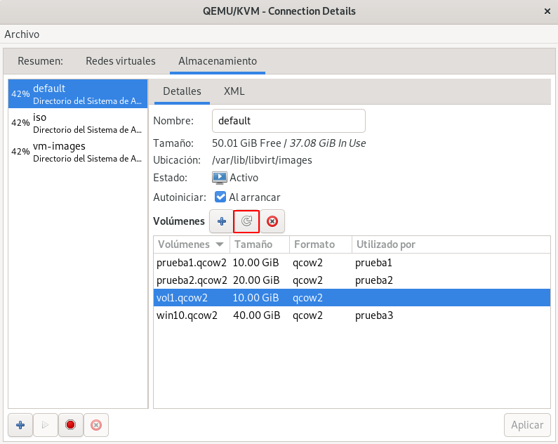

# Gestión de volúmenes de almacenamiento con herramientas específicas

En este apartado vamos a gestionar los volúmenes con herramienta especificas. Es decir, si estamos trabajando con un pool de tipo **dir** y con volúmenes que corresponde a ficheros de imágenes de disco, vamos a trabajar con la herramienta `qemu-img`. Esta potente herramienta nos permite la gestión completa de los ficheros de imágenes de disco.

## Gestión de imágenes de disco con qemu-img

La herramienta `qemu-img` es una utilidad para gestionar ficheros de imagen de disco. Puedes profundizar en el uso de esta herramienta consultando la documentación oficial: [QEMU disk image utility](https://qemu.readthedocs.io/en/latest/tools/qemu-img.html).

Vamos a crear un nuevo fichero de imagen llamado `vol2.qcow2`, con el formato `qcow2`, con un tamaño de 2GB, en el directorio `/srv/images`, correspondiente al pool `vm-images`, que creamos en un apartado anterior (si quisiéramos trabajar con el pool `default` trabajaríamos en el directorio `/var/lib/libvirt/images`).

```
cd /srv/images/
qemu-img create -f qcow2 vol2.qcow2 2G
Formatting 'vol2.qcow2', fmt=qcow2 cluster_size=65536 extended_l2=off compression_type=zlib size=2147483648 lazy_refcounts=off refcount_bits=16

```

Podemos obtener información de la imagen que hemos creado, ejecutando en el mismo directorio:

```
qemu-img info vol2.qcow2
image: vol2.qcow2
file format: qcow2
virtual size: 2 GiB (2147483648 bytes)
disk size: 196 KiB
cluster_size: 65536
Format specific information:
    compat: 1.1
    compression type: zlib
    lazy refcounts: false
    refcount bits: 16
    corrupt: false
    extended l2: false
```

La creación del fichero de imagen, no conlleva de forma automática la creación del volumen en el pool de almacenamiento. Si vemos la lista de volúmenes en el pool `vm-images` comprobamos que no se ha creado:

```
virsh -c qemu:///system vol-list vm-images
 Nombre            Ruta
------------------------------------------------------------
```

Para que se cree un nuevo volumen a partir del fichero que hemos creado, necesitamos **refrescar** el pool, para ello:

```
virsh -c qemu:///system pool-refresh vm-images
El grupo vm-images ha sido actualizado
```

Y comprobamos que ya tenemos el volumen creado ejecutando: `virsh -c qemu:///system vol-list vm-images`.

Para refrescar un pool desde `virt-manager` usamos el siguiente botón:



La herramienta `qemu-img` es muy potente y nos permite realizar muchas operaciones: redimensionar el fichero de imagen, convertir entre formatos de imágenes, crear imágenes a a partir de imágenes base, crear instantáneas de imágenes, ... Utilizaremos algunas de estas funciones en apartados posteriores del curso.

**Nota: Si estuviéramos trabajando con otro tipo de Pool de Almacenamiento, tendráimos que usar herramientas especificar para gestionar los medios de almacenamientos adecuados. Por ejemplo, si estuviéramos trabajando con un pool de tipo logical, usaríamos las herramientas de comando de LVM para crear y gestionar los volúmenes lógicos que se corresponderían con los volúmenes de este tipo de pool.**
