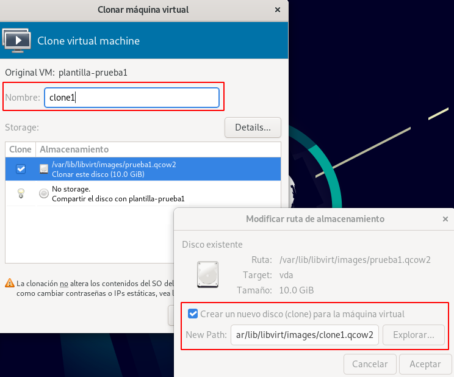
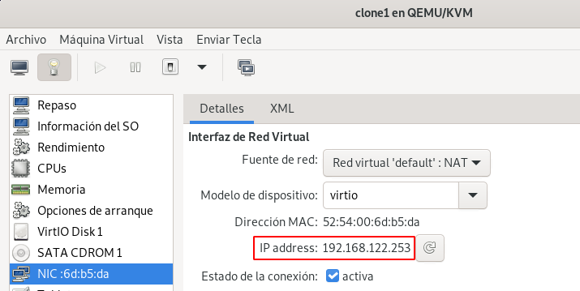
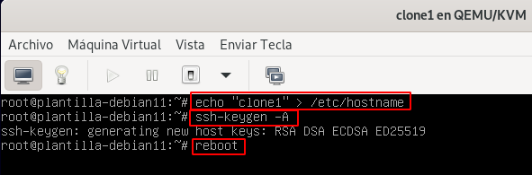

# Clonación completa a partir de plantillas

La clonación completa a partir de una plantilla es similar a la clonación de máquinas virtuales que vimos en un punto anterior.

## Uso virt-clone para realizar la clonación

Podemos usar el siguiente comando para realizar la clonación:

```
virt-clone --connect=qemu:///system --original plantilla-prueba1 --name clone1 --auto-clone
```

Recuerda que puedes usar el parámetro `--file` para indicar el nombre de la imagen de la nueva máquina que clonamos.

El proceso puede ser lento, ya que se hace una copia completa de la imagen original a la de la nueva máquina virtual.

## Uso de virt-manager para realizar la clonación

Si elegimos la plantilla y pulsamos el botón derecho del ratón tenemos a nuestra disposición la opción **Clonar**:



Donde podemos indicar el nombre de la nueva máquina virtual, y si pulsamos sobre el botón **Details...** podemos cambiar el nombre del nuevo fichero de imagen donde se realiza la clonación.

## Problemas de acceso por SSH

Si intentamos acceder por SSH a la nueva máquina vamos a comprobar que no nos lo permite. Para realizar la conexión por SSH vamos a averiguar la IP de la máquina, para ello podemos ejecutar:

```
virsh -c qemu:///system domifaddr clone1
 Nombre     dirección MAC       Protocol     Address
-------------------------------------------------------------------------------
 vnet0      52:54:00:6d:b5:da    ipv4         192.168.122.253/24
```

O usando `virt-manager` vemos el detalle de la interfaz de red:



Si desde el host intentamos acceder por SSH, obtenemos:

```
ssh usuario@192.168.122.253
ssh: connect to host 192.168.122.253 port 22: Connection refuse
```

Esto es debido a que cuando ejecutamos el `virt-sysprep` uno de los datos que se eliminaron fueron las claves SSH de la máquina para que no fueran los mismos que los de la máquina original. Por lo tanto tenemos que regenerar estas claves en la nueva máquina ejecutando el comando `ssh-keygen -A`, y de paso le vamos a cambiar el `hostname`:



Una reiniciada la máquina ya podemos acceder por SSH desde el host:

```
ssh usuario@192.168.122.253
...

usuario@clone1:~$ 
```
