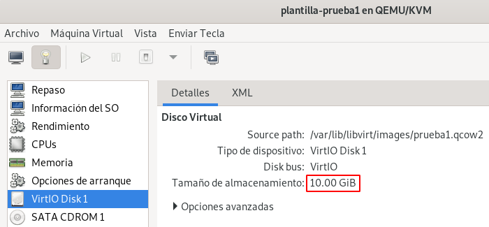
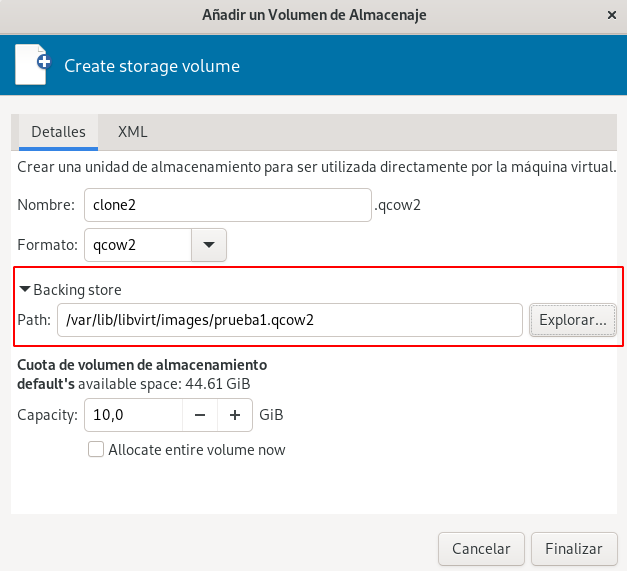
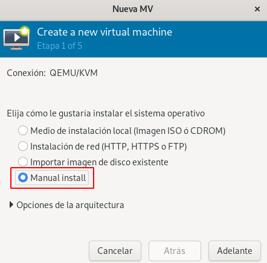
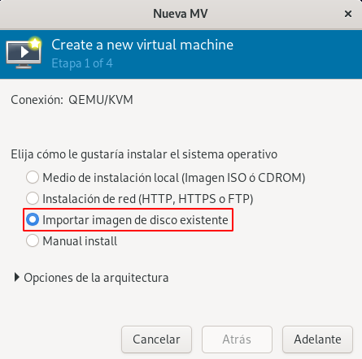
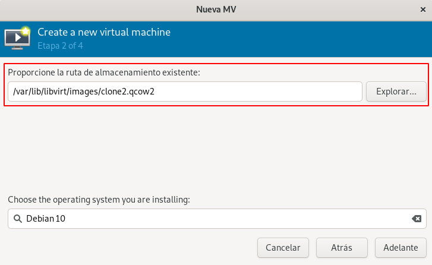

# Clonación enlazada a partir de plantillas

En este tipo de clonación la imagen de la máquina clonada utiliza la imagen de la plantilla como imagen base (**backing store**) en modo de sólo lectura, en la imagen de la nueva máquina sólo se guardan los cambios del sistema de archivo. Requiere menos espacio en disco, pero no puede ejecutarse sin acceso a la imagen de plantilla base. 

El mecanismo es un poco más complejo, tenemos que realziar dos pasos:

1. Creación del nuevo volumen a a partir de la imagen base de la plantilla (**backing store**).
2. Creación de la nueva máquina usando `virt-install`, `virt-manager` o `virt-clone`.

## Creación de imágenes de disco con backing store

Para no complicar la creación de volúmenes con backing store vamos a indicar el tamaño del nuevo volumen igual al de la imagen base. Como la imagen base ya tiene guardado un sistema de archivos con un tamaño determinado, el hecho de que creemos una nueva imagen con más tamaño no conlleva el redimensionado del sistema de archivo. Este cambio de tamaño se podría realizar, pero con operaciones un poco más complejas.

Para asegurarnos de crear un volumen del mismo tamaño que la imagen base vamos comprobar su tamaño:
```
virsh -c qemu:///system domblkinfo plantilla-prueba1 vda --human
Capacidad:      10,000 GiB
...
```

También lo podemos ver con `virt-manager`:



Para crear la nueva imagen basada en la imagen base de la plantilla, podemos crear el volumen con `virsh`:

```
virsh -c qemu:///system vol-create-as default clone2.qcow2 10G --format qcow2 --backing-vol prueba1.qcow2 --backing-vol-format qcow2 
```

O podemos usar la aplicación `qemu-img` y posterior refrescamos el pool `default`:

```
cd /var/lib/libvirt/images
sudo qemu-img create -f qcow2 -b prueba1.qcow2 -F qcow2 clone2.qcow2 10G
virsh -c qemu:///system pool-refresh default
```

Otra opción es usando `virt-manager`, creando un nuevo volumen e indicando durante la dirección el volumen base:



### Información sobre imágenes de con disco con backing store

Para comprobar que un volumen está creado con una imagen base podemos usar `virsh`:

```
virsh -c qemu:///system vol-dumpxml clone2.qcow2 default
...
<backingStore>
    <path>/var/lib/libvirt/images/prueba1.qcow2</path>
    <format type='qcow2'/>
    <permissions>
    ...
```

O usando el comando `qemu-img`:

```
sudo qemu-img info /var/lib/libvirt/images/clone2.qcow2
...
backing file: prueba1.qcow2
backing file format: qcow2
...
```

## Creación de la nueva máquina a partir de la imagen con backing store con virt-install

En este caso podemos usar la herramienta `virt-install` pero sin indicar el medio de instalación.

```
virt-install --connect qemu:///system \
			 --virt-type kvm \
			 --name nueva_prueba \
			 --os-variant debian10 \
			 --disk path=/var/lib/libvirt/images/prueba6.qcow2 \
			 --memory 1024 \
			 --vcpus 1 \
			 --import
```		

Usamos la opción `--import` para que no te pida que indique el medio de instalación, simplemente va a usar el volumen indicado como disco de la máquina virtual.


## Creación de la nueva máquina a partir de la imagen con backing store con virt-manager

Si utilizamos `virt-manager`, para crear la nueva máquina, durante el asistente de creación de la máquina, elegimos la opción **Manual install**, ya que no vamos a usar una imagen ISO:



Y posteriormente, escogemos el volumen que tenemos creado:


Otra forma, sería escogiendo la opción **Importar imagen de disco existente** en la creación de la máquina:



Y eligiendo el volumen en siguiente paso:




## Creación de la nueva máquina a partir de la imagen con backing store con virt-clone

Una vez que tenemos creado el volumen basada en el imagen base de la plantilla, podemos crear un nuevo clon con `virt-clone`, para ello ejecutamos:

```
virt-clone --connect=qemu:///system --original plantilla-prueba1 --name clone2 --file /var/lib/libvirt/images/clone2.qcow2 --preserve-data
```

Indicamos como fichero el volumen que hemos creado, pero con la opción `--preserve-data` no se copia el volumen original al nuevo, simplemente se usa. Se puede comprobar que la clonación no tarda nada de tiempo, no se está copiando un volumen en otro.

