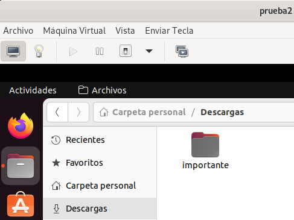
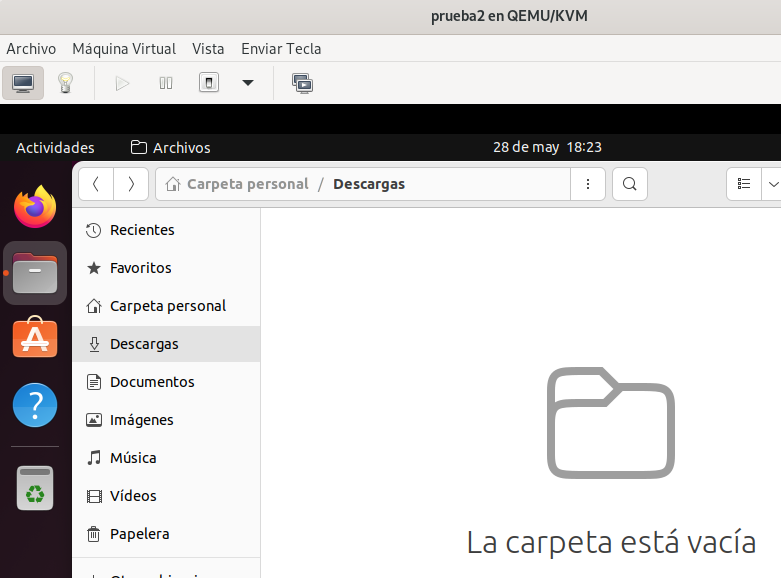
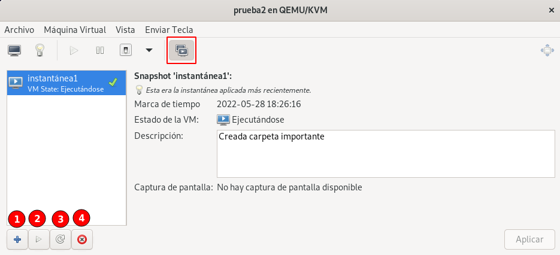
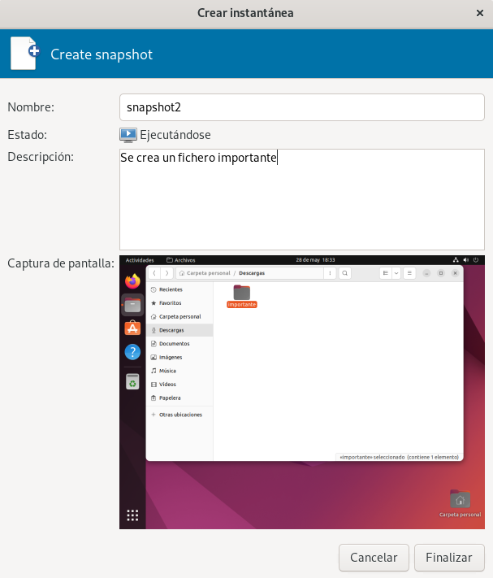

# Instantáneas de máquinas virtuales

Un snapshot (instantánea) nos posibilita guardar el estado de una máquina virtual en un determinado momento. Se guarda el estado del disco y el estado de la memoria. De esta forma en el futuro puedo volver a un estado anterior de la misma. No todos los formatos y medios de almacenamiento nos posibilitan esta características. Un fichero de imagen de disco con formato `qcow2` si nos permite la realización de instantáneas.

## Gestión de instantáneas con virsh

Vamos a trabajar con la máquina `prueba2` donde tenemos una instalación de Ubuntu 22.04. 

Hemos hecho un cambio significativo en nuestra máquina (en el ejemplo hemos creado una carpeta). 



Ahora es el momento de crear una instantánea, de esta manera podremos volver a este estado en un momento futuro:

```
virsh -c qemu:///system snapshot-create-as prueba2 --name instantánea1 --description "Creada carpeta importante" --atomic
Ha sido creada la captura instantánea instantánea1 del dominio
```

Se recomienda utilizar la opción `--atomic` para evitar cualquier corrupción mientras se toma la instantánea. Para ver las instantáneas que tiene creada la máquina podemos ejecutar:

```
virsh -c qemu:///system snapshot-list prueba2
  Nombre         Hora de creación            Estado
 -----------------------------------------------------
  instantánea1   2022-05-28 18:13:46 +0200   running
```

También podemos ver las instantáneas de un fichero de imagen con la herramienta `qemu-img` (la máquina debe estar parada):

```
sudo qemu-img info /var/lib/libvirt/images/prueba2.qcow2
image: /var/lib/libvirt/images/prueba2.qcow2
file format: qcow2
virtual size: 20 GiB (21474836480 bytes)
disk size: 11.9 GiB
cluster_size: 65536
Snapshot list:
ID        TAG               VM SIZE                DATE     VM CLOCK     ICOUNT
1         instantánea1     1.79 GiB 2022-05-28 18:13:46 00:16:12.485    
...
```

Los snapshot son otro recurso de libvirt cuya definición se guarda en formato XML. Podríamos usar el comando `snapshot-dumpxml` para ver su definición. Tenemos más comandos relacionados con las instantáneas: para obtener información de una instantánea usamos `snapshot-info`, `snapshot-delete` para borrar una instantánea ,... 

Si hemos tenido un problema en nuestra máquina y hemos eliminado nuestra carpeta importante:



Podemos volver al estado de una determinada instantánea ejecutando:

```
virsh -c qemu:///system snapshot-revert prueba2 instantánea1
```

Y comprobamos que hemos vuelto al estado de la máquina donde teníamos creada la carpeta:


## Gestión de instantáneas con virt-manager

Accediendo a la **Vista Instantáneas** obtenemos la ventana para gestionar las instantáneas:



Tenemos botones para las opción más comunes:

* **Botón 1**: Crear instantánea.
* **Botón 2**: Volver al estado de la instantánea seleccionada.
* **Botón 3**: Refrescar la lista de instantáneas.
* **Botón 4**: Borrar la instantánea seleccionada.

Al crear una instantánea, podemos indicar el nombre, la descripción y se guarda una captura de pantalla de la máquina.



## Conclusión

Puede ser muy interesante tomar instantáneas periódicamente a una máquina virtual. Si tenemos cualquier problema con la máquina podemos volver a un estado estable anterior.
Esta característica puede ser muy útil, ya que nos permite experimentar con la máquina, y si tenemos algún problema, podemos volver al estado original y no tener que eliminar la máquina.
