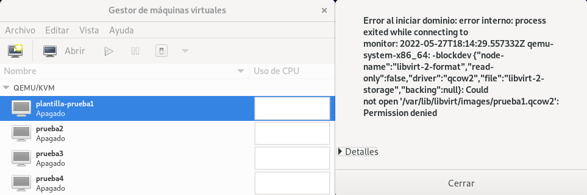

# Plantillas de máquinas virtuales

Una plantilla de máquina virtual, o simplemente **plantilla** es una imagen preconfigurada de un sistema operativo que puede utilizarse para desplegar rápidamente
máquinas virtuales. El uso de plantillas permite evitar muchas tareas repetitivas de instalación y configuración. El resultado es la creación de máquinas virtuales totalmente instaladas y listas para funcionar en menos tiempo de lo que tardaría una instalación manual.

Con la herramienta `virt-clone` hemos creado un clon de una máquina virtual, es decir, una copia de una máquina. Una plantilla es una *copia maestra* que podemos utilizar para crear muchos clones.

Una vez tengamos una plantilla, tendremos dos manera de crear las nuevas máquinas:

* **Clonación completa (Full)**: Creamos una copia completa de la máquina virtual que es totalmente independiente de la plantilla. Requiere el mismo espacio en disco que el original.
* **Clonación enlazada (Linked)**: Utiliza la imagen de la plantilla como imagen base en modo de sólo lectura y vincula una imagen adicional de "copia en escritura" para almacenar los nuevos datos generados. Requiere menos espacio en disco, pero no puede ejecutarse sin acceso a la imagen de plantilla base.

## Creación de plantillas

Tendríamos que realizar tres pasos fundamentales:

En primer lugar, crear e instalar un nueva máquina virtual e instalarle todo el software necesario. A partir de esa máquina vamos a crear la plantilla.

En segundo lugar, vamos a generalizar la imagen, es decir, vamos a eliminar toda la información que debería ser única en una máquina ( contiene identificadores que deberían ser únicos (como el machine ID, direcciones MAC, claves SSH de host, hostname, ...). De tal forma, que las máquinas clonadas, regenerarán esta información de for ma única al iniciarlas.

En máquinas Linux vamos a usar la utilidad `virt-sysprep`, para máquinas Windows podemos usar los mecanismos propios de generalización que posee: [sysprep](https://docs.microsoft.com/es-es/windows-hardware/manufacture/desktop/sysprep--generalize--a-windows-installation?view=windows-11).

Para poder utilizar `virt-sysprep` tenemos que instalar el siguiente paquete:

```
apt-get install libguestfs-tools
```

[`virt-sysprep`](https://libguestfs.org/virt-sysprep.1.html) puede trabajar con un fichero de imaǵen, usando la opción `-a`, pero en nuestro caso vamos indicarle una máquina virtual, usando el parámetro `-d`.

Vamos a suponer que vamos a convertir en plantilla nuestra máquina `prueba1` que tiene un sistema GNU/Linux Debian 11 instalado. Nuestra máquina original tiene que estar parada. Y para generalizarla, ejecutamos como superusuario:

```
sudo virt-sysprep -d prueba1 --hostname plantilla-debian11
[   0.0] Examining the guest ...
...
```

`virt-sysprep` tienes muchas opciones de configuración, hemos usado el parámetro `-hostname` para cambiar el nombre de la máquina de la plantilla.

En último lugar, tenemos que evitar ejecutar está máquina de nuevo, ya que la generalización que hemos hecho se perdería. Para conseguirlo vamos a **configurar la imagen original de solo lectura**, de esta manera al intentar ejecutar la plantilla nos dará un error. Para ello como superusuario:

```
/var/lib/libvirt/images# chmod -w prueba1.qcow2 
```

Además, vamos a cambiar el nombre a la máquina para recordar que es un plantilla:

```
virsh -c qemu:///system domrename prueba1 plantilla-prueba1
Domain successfully renamed
```

Este cambio también se podría hacer con `virt-manager`.

Si intentamos ejecutar la plantilla, nos dará un error:



En cualquier momento podemos cambiar la configuración de la plantilla. Todas las nuevas máquinas clonadas a partir de ella tendrán la misma configuración.

Ya tenemos la plantilla lista para ser clonada. Lo veremos en los siguientes apartados.
