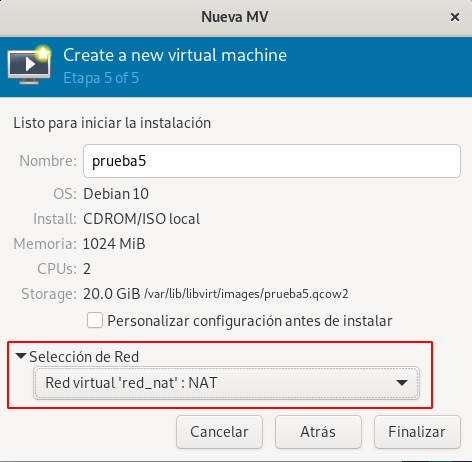
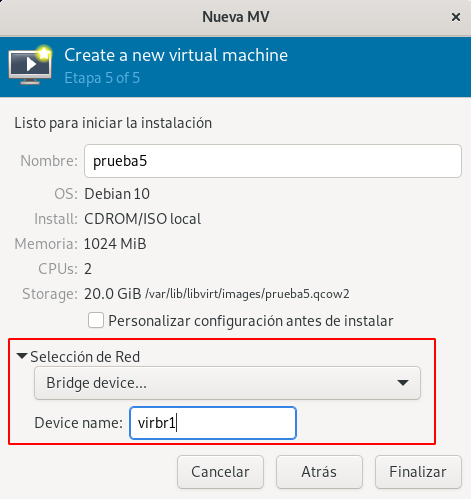
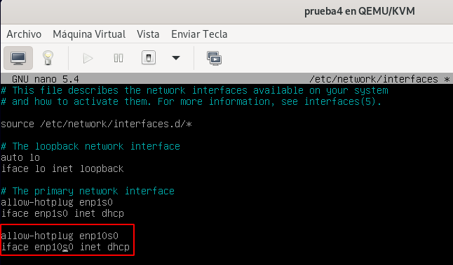
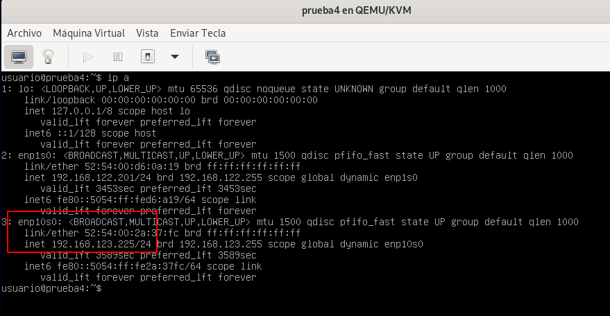
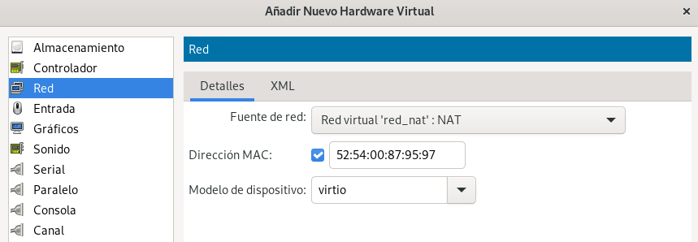
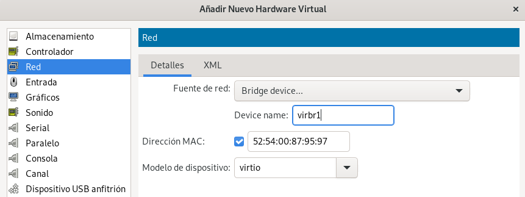
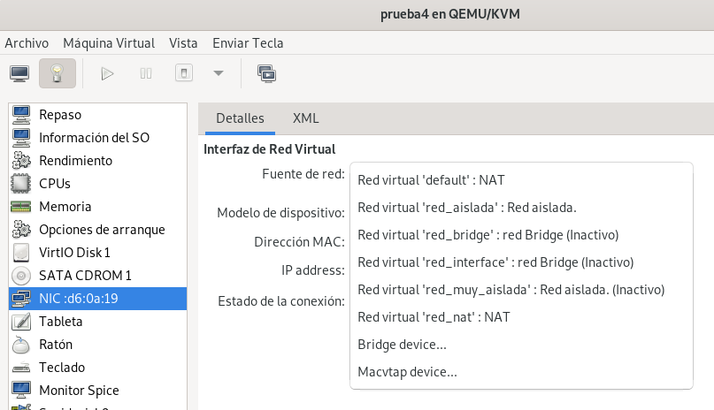
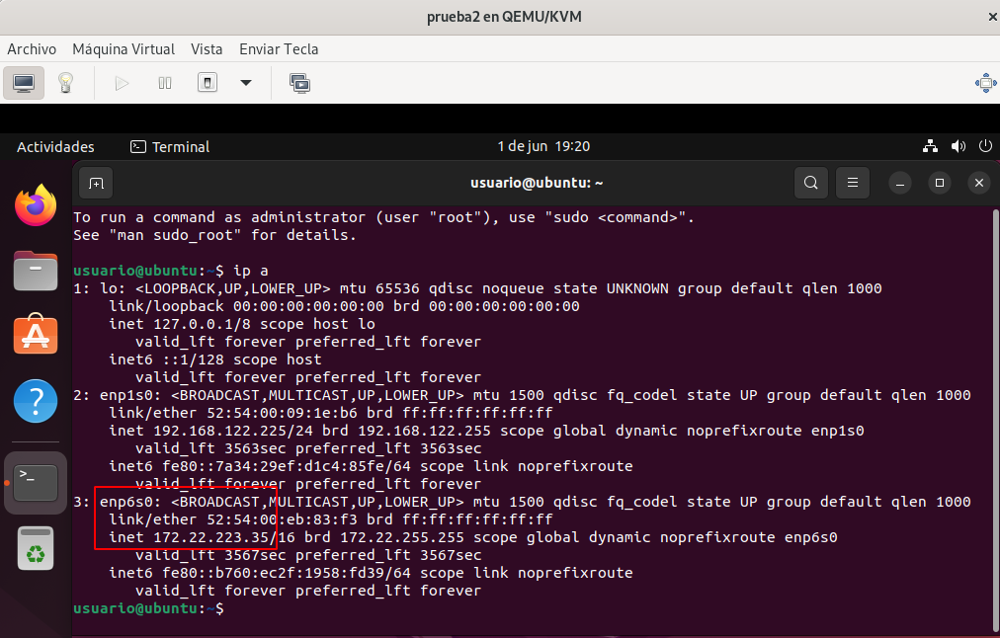
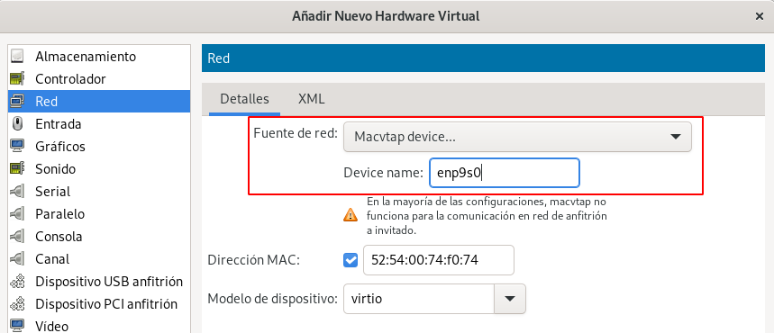
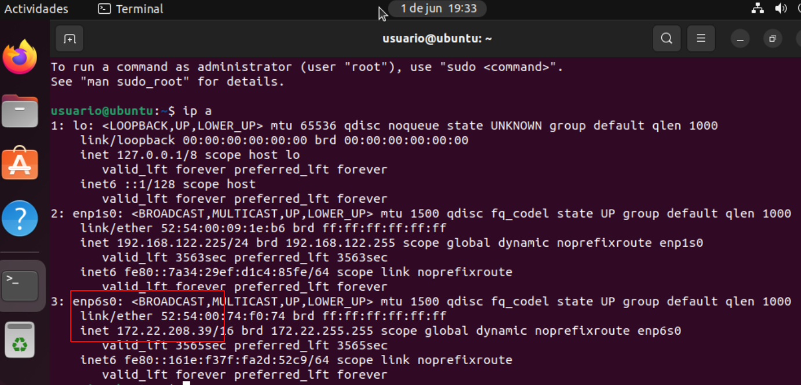

# Configuración de red en las máquinas virtuales

Todas las máquinas que hemos creado durante el curso se han conectado de forma predeterminada a la red `default`. 

Sin embargo, en este apartado vamos a aprender algunas cosas nuevas: a crear máquinas virtuales conectadas a otras redes definidas por el usuario y a añadir interfaces de red a máquinas virtuales ya existentes.

## Crear máquinas virtuales conectada a una red existente

Para crear una máquina virtual conectada, por ejemplo, a la red `red_nat`, podemos usar `virt-install`:

```
virt-install --connect qemu:///system \
			 --virt-type kvm \
			 --name prueba5 \
			 --cdrom ~/iso/debian-11.3.0-amd64-netinst.iso \
			 --os-variant debian10 \
			 --network network=red_nat \
			 --disk size=10 \
			 --memory 1024 \
			 --vcpus 1
```

* Con la opción `--network network=red_nat` indicamos que la máquina tendrá una interfaz de red conectada a la red cuyo nombre es `red_nat`.
* Para conectar una máquina a una red también podemos indicar el bridge virtual al que queremos conectarla. en este caso utilizaríamos la opción `--network bridge=virbr1`. `vribr1` es el bridge virtual que gestiona la red `red_nat`.
* Si indicamos varios parámetros `--network`, estaríamos añadiendo a la nueva máquina varias interfaces de red.

Si utilizamos `virt-manager`, para crear la nueva máquina, durante el asistente de creación de la máquina, el el último paso, podemos escoger la red a la que nos vamos a conectar:



También podemos escoger el puente virtual al que nos queremos conectar:



## Añadir nuevas interfaces de red a máquinas virtuales

Para añadir una nueva interfaz de red a una máquina virtual, vamos a modificar su definición XML. Podríamos usar `virsh edit` e incluir la definición XML de la nueva interfaz. Sin embargo, vamos a usar un comando de `virsh` que nos facilita la operación de añadir una nueva interfaz de red y por tanto, la modificación de la definición XML de la máquina. Es recomendable hacer esta operación con la máquina parada.

Por lo tanto, vamos a añadir a la máquina `prueba4` una interfaz de red conectada a la red `red_nat`. Para ello, ejecutamos:

```
virsh -c qemu:///system attach-interface prueba4 network red_nat --model virtio --persistent
La interfaz ha sido asociada exitosamente
```

Si la máquina virtual no tiene entorno gráfico y por tanto no tiene instalado el programa `NetworkManager` habrá que acceder a ella y configurar la nueva interfaz de red.

En nuestro caso es una máquina virtual con Debian 11, donde se ha creado un  interfaz con el nombre `enp10s0`. Para configurarla modificamos el fichero `/etc/network/interfaces`:



Levantamos la interfaz y comprobamos que la nueva interfaz de red ha tomado configuración de red en el direccionamiento que habíamos configura en la red `red_nat`:



Además, podríamos ver la configuración de las interfaces de red con el comando `virsh`:

```
virsh -c qemu:///system domifaddr prueba4
 Nombre     dirección MAC       Protocol     Address
-------------------------------------------------------------------------------
 vnet7      52:54:00:d6:0a:19    ipv4         192.168.122.201/24
 vnet8      52:54:00:2a:37:fc    ipv4         192.168.123.225/24
```


Podríamos añadir una nueva interfaz de red indicando el puente virtual al que queremos realizar la conexión. En este caso tendríamos que ejecutar la misma instrucción pero el tipo de la conexión será `bridge`:

```
virsh -c qemu:///system attach-interface prueba4 bridge virbr1 --model virtio --persistent
La interfaz ha sido asociada exitosamente
```


Y comprobamos que tenemos una tercera interfaz:

```
virsh -c qemu:///system domiflist prueba4
 Interfaz   Tipo      Fuente    Modelo   MAC
------------------------------------------------------------
 -          network   default   virtio   52:54:00:d6:0a:19
 -          network   red_nat   virtio   52:54:00:2a:37:fc
 -          bridge    virbr1    virtio   52:54:00:0c:06:2a
```

Por último indicar que si queremos desconectar una interfaz de red tenemos que indicar el tipo (`network` o `bridge`) y la dirección MAC:

```
virsh -c qemu:///system detach-interface prueba4 bridge --mac 52:54:00:0c:06:2a --persistent 
La interfaz ha sido desmontada exitosamente
```

También lo podemos hacer desde `virt-manager`. Si **añadimos nuevo hardware** en la vista detalle de la máquina, podemos añadir una nueva conexión indicando la red:



O indicando el puente virtual donde nos vamos a conectar:



También podemos modificar en cualquier momento a la red o al puente al que estamos conectado, modificando la interfaz de red desde la vista detalles:



Para eliminar la interfaz de red desde `virt-manager` simplemente pulsaríamos con el botón derecho sobre el dispositivo de red en la vista detalle, y pulsaríamos sobre **Eliminar Hardware**.

## Consideraciones finales

* Si conectamos una máquina virtual a una **Red de tipo Aislada**, tendremos que configurar de forma estática la interfaz y poner el mismo direccionamiento que hemos configurado para el host. Por ejemplo, para la red `red_aislada` usamos el direccionamiento `192.168.123.0/224` y la dirección que le asignamos al host fue `192.168.123.1`. Otras máquinas conectadas a esta red tendrán que estar configurada con el mismo direccionamiento.
* Si conectamos una máquina virtual a una **Red de tipo Muy Aislada**, tendremos que configurar de forma estática la interfaz y poner el direccionamiento que nos interese. Normalmente todas las máquinas conectada a esta red tendrán el mismo direccionamiento para que tengan conectividad entre ellas.
* Si conectamos a una **Red de tipo Bridge conectada a un bridge externo**, la máquina virtual se configurará con el mismo direccionamiento que el host. En mis caso, trabajo con la red local `172.22.0.0/16`, si conecto la máquina `prueba2` (tiene instalada un Ubuntu con NetworkManager) al bridge externo `br0`, tomará la siguiente configuración:

	```
	virsh -c qemu:///system attach-interface prueba2 bridge br0 --model virtio --persistent
	La interfaz ha sido asociada exitosamente
	```

	Iniciamos la máquina y comprobamos como la interfaz que acabamos de añadir se configura con el direccionamiento de la red local. Esta en la misma red que el host:

	

* Finalmente, si conectamos a una **Red de tipo Bridge compartiendo la interfaz física del host** también se debe configurar en la misma red local del host. Para realizar la conexión podríamos conectarnos a la red `red_interface` como hemos anteriormente. Desde `virt-manager` también podemos hacer la conexión indicando el dispositivo físico que vamos a usar:

	

	Iniciamos la máquina y comprobamos:
	
	
