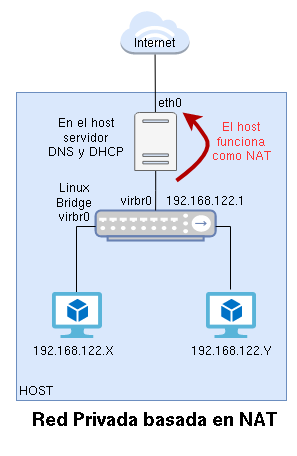
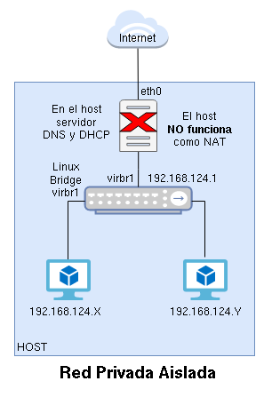
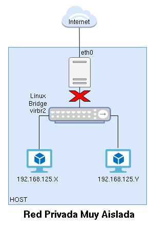
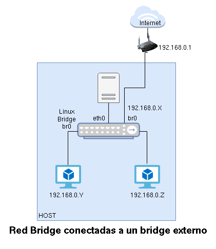
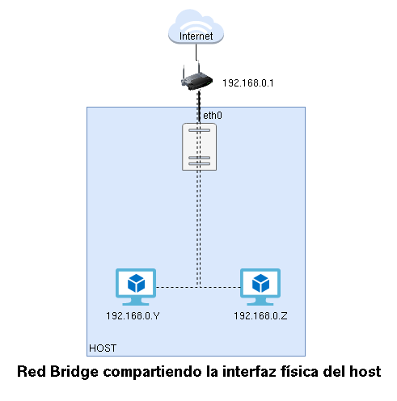

# Introducción a la gestión de redes en QEMU/KVM + libvirt

libvirt nos proporciona las herramientas necesarias para gestionar las redes virtuales a las que se conectan nuestras máquinas virtuales.

Tenemos dos grandes grupos de redes que podemos configurar:

* **Redes Virtuales (Privadas)**: Son **redes privadas** que podemos configurar para que tengan distintas características.
* **Redes Puente (Públicas)**: Las podemos considerar como **redes públicas**, desde el punto de vista que las máquinas virtuales estarán conectadas a la misma red a la que está conectada el host.

Recordemos un **puente o bridge/switch** es un dispositivo de interconexión de redes. La gestión de redes de libvirt se basa en el concepto de **switch virtual**, para ello utiliza **Linux Bridge**, que es un software que nos permite crear bridge virtuales con la misma funcionalidad que un bridge físico.

## Tipos de Redes Virtuales (Privadas)

La clasificación dependerá de la configuración que hagamos a la **Red Virtual**:

### Redes Virtuales de tipo NAT

Es un Red Virtual Privada, las máquinas virtual tendrán un direccionamiento privado y se nos proporciona un mecanismo de **router/nat** para que tengan conectividad al exterior.

La red `default` con la que hemos trabajado es de este tipo. Veamos sus características:

* Crea un bridge virtual donde se conectan las máquinas virtuales. En el caso de la red `default` se llama `vmbr0`. A este bridge también está conectado el host.
* Las máquinas virtuales se configuraran de forma dinámica por medio de un servidor DHCP. En el caso de la red `default`, el **rango de direcciones** es `192.168.122.2` - `192.168.122.254`. La **puerta de enlace** de las máquinas se configura con la dirección IP `192.168.122.1` que corresponde al host. El **servidor DHCP** esta configurado en el host. 
* En el host también se configura un **servidor DNS** que es el que se configura en las máquinas virtuales.
* El host hace la función de **router/nat** de tal manera que las máquinas virtuales tienen conectividad al exterior, usando la dirección IP de la interfaz de red del host que está conectada al exterior.

	Existen otros mecanismos para que las máquinas virtuales tengan acceso al exterior:

	* **Modo bridge**: Donde se usan rutas de encaminamiento en el host. En este modo hay que configurar con rutas estáticas los elementos de enrutamiento de la red local para que funcione de manera adecuada.
	* **Modo abierto**: Similar a la anterior, excepto que no se añaden reglas de firewall para asegurar que cualquier tráfico pase o no. Se asume que, o bien no son necesarias, o bien se configuran fuera del ámbito de libvirt.

	En este curso vamos a trabajar con Redes Virtuales de tipo NAT.

### Redes Virtuales aisladas (Isolated)

Es un Red Virtual Privada, donde las máquinas virtuales tomas direccionamiento privado. No tenemos un mecanismo de router/nat, por lo que las máquinas virtuales no tienen conectividad con el exterior. 

Por lo tanto tienen las mismas características que una Red Virtual de tipo NAT, pero sin la característica de router/nat. Se gestiona un bridge virtual donde se conectan las máquinas virtuales y el host, seguimos teniendo un servidor DNS y es posible tener un servidor DHCP en el host que asigna dinámicamente un direccionamiento privado a las máquinas.

### Redes Virtuales muy aisladas (Very Isolated)

Es un Red Virtual Aislada, en la que el host no está conectado a las máquians virtuales. Por lo tanto,no tenemos servidor DNS ni DHCP para ser utilizados por las máquinas. Al ser aislada, tampoco tienen salida al exterior.

En este tipo de red se suele configurar la red de las máquinas virtuales de forma estática.

## Tipos de Redes Puente (Públicas)

La clasificación depende de la forma utilizada para conectar las máquinas virtuales al exterior.

### Redes Puente conectadas a un bridge externo

En este caso necesitamos crear un bridge virtual (normalmente llamado `br0`) al que conectaremos la máquina física y las máquinas virtuales. En este caso las máquinas virtuales estarán en la misma red red que el host y estarán conectadas directamente al router de esta red, tomando la configuración dhcp (si la hubiera) del mismo modo que la toma el host.

### Redes Puente compartiendo la interfaz física del host

En este caso vamos a usar una conexión macvtap, que nos permite conectarnos a la red física directamente a través de una interfaz física del host (sin usar un dispositivo bridge). Al igual que con la red anterior, las máquinas virtuales estarán conectados directamente a la red física, por lo que sus direcciones IP estarán todas en la subred de la red física. Existe una una limitación en la implementación de macvtap: estas conexiones no permiten la comunicación directa entre el host y los invitados.

