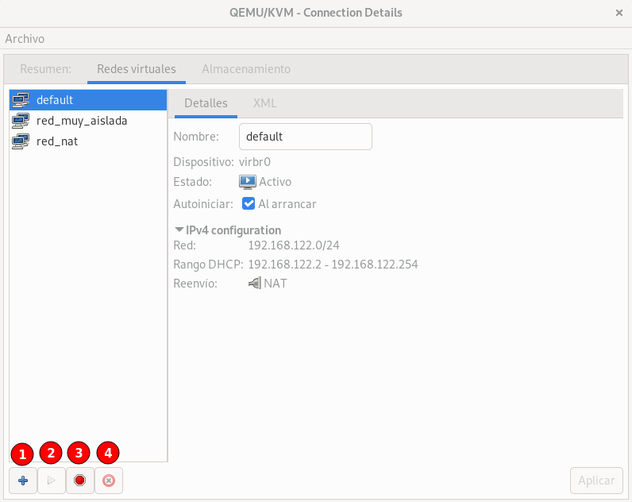
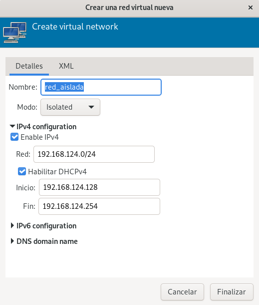
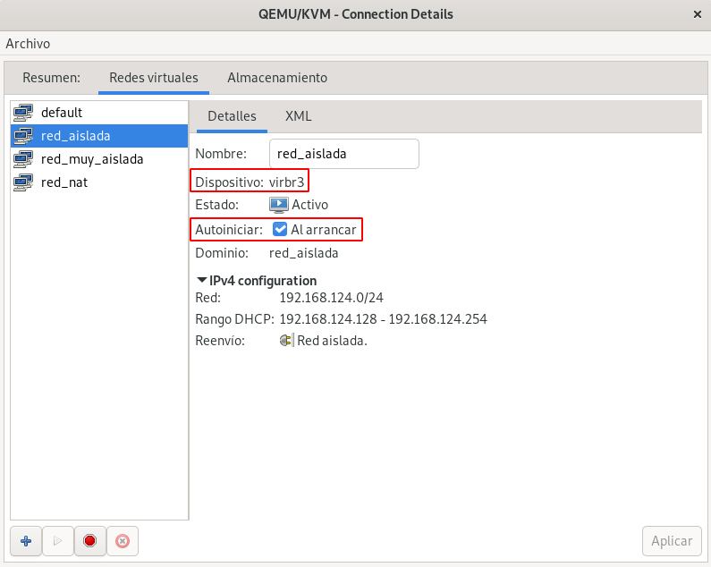
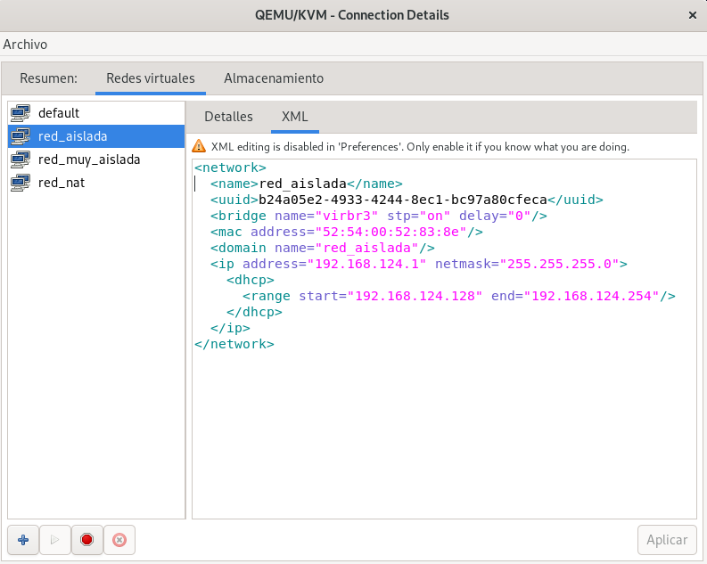

# Gestión de Redes Virtuales

En este apartado vamos  a estudiar como trabajar con las redes virtuales con `virsh` y `virt-manager`.

## Gestión de Redes Virtuales con virsh

Podemos ver las redes que tenemos definidas ejecutando:

```
virsh -c qemu:///system net-list --all
 Nombre    Estado   Inicio automático   Persistente
-----------------------------------------------------
 default   activo   si                  si
```

Utilizamos la opción `--all` para listar las redes iniciadas y paradas.

Las redes se crean a partir de su definición XML que tenemos guardado en un fichero. En este caso tenemos el fichero `red-nat.xml`, donde tenemos la definición de una red virtual de tipo NAT, con el siguiente contenido:

```xml
<network>
  <name>red_nat</name>
  <bridge name='virbr1'/>
  <forward/>
  <ip address='192.168.123.1' netmask='255.255.255.0'>
    <dhcp>
      <range start='192.168.123.2' end='192.168.123.254'/>
    </dhcp>
  </ip>
</network>
```

Para crear la nueva red, ejecutamos:

```
virsh -c qemu:///system net-define red-nat.xml
La red red_nat se encuentra definida desde red-nat.xml
```

Si utilizamos el comando `virsh create` estaríamos creando la red de forma temporal, no persistente.

La red no se puede utilizar hasta que no se inicie, para ello:

```
virsh -c qemu:///system net-start red_nat
La red red_nat se ha iniciado
```

Si vamos a usar esta red con mucha frecuencia es recomendable activar la propiedad de autoiniciar para que se inicie de forma automática al iniciar el host. Para ello:

```
virsh -c qemu:///system net-autostart red_nat
La red red_nat ha sido marcada para iniciarse automáticamente
```

Podemos obtener información de la red ejecutando:

```
virsh -c qemu:///system net-info red_nat
Nombre:         red_nat
UUID:           af756f61-9ffd-44d0-850f-90a75db773c1
Activar:        si
Persistente:    si
Autoinicio:     si
Puente:         virbr1
```

Al iniciar podemos comprobar que se ha creado el bridge virtual y una nueva interfaz de red en el host.

```
sudo brctl show
bridge name	bridge id		STP enabled	interfaces
virbr0		8000.525400aea33d	yes		
virbr1		8000.5254002daec2	yes	
```

En el host, el bridge virtual aparece como una interfaz de red:

```
ip a
...
4: virbr0: <NO-CARRIER,BROADCAST,MULTICAST,UP> mtu 1500 qdisc noqueue state DOWN group default qlen 1000
    link/ether 52:54:00:ae:a3:3d brd ff:ff:ff:ff:ff:ff
    inet 192.168.122.1/24 brd 192.168.122.255 scope global virbr0
       valid_lft forever preferred_lft forever
5: virbr1: <NO-CARRIER,BROADCAST,MULTICAST,UP> mtu 1500 qdisc noqueue state DOWN group default qlen 1000
    link/ether 52:54:00:2d:ae:c2 brd ff:ff:ff:ff:ff:ff
    inet 192.168.123.1/24 brd 192.168.123.255 scope global virbr1
       valid_lft forever preferred_lft forever
```

Podemos considerar que la interfaz de red del bridge virtual corresponde a la conexión del host con el bridge.

Para ver la definición XML de la red que hemos creado, ejecutamos:

```
virsh -c qemu:///system net-dumpxml red_nat
```

Podemos crear también una red muy aislada de la que tenemos guardada la definición XML en el fichero `red-muy-aislada.xml`, con el contenido:

```xml
<network>
  <name>red_muy_aislada</name>
  <bridge name='virbr2'/>
</network>
```

Y si la creamos y la iniciamos:

```
virsh -c qemu:///system net-define red-muy-aislada.xml
La red red_muy_aislada se encuentra definida desde red-muy-aislada.xml

virsh -c qemu:///system net-start red_muy_aislada
La red red_muy_aislada se ha iniciado
```

Comprobamos que se ha creado el bridge virtual. 

```
sudo brctl show
bridge name	bridge id		STP enabled	interfaces
virbr0		8000.525400aea33d	yes		
virbr1		8000.5254002daec2	yes		
virbr2		8000.525400d51f31	yes
```

Pero al ser una red muy aislada, el host no está conectado al bridge, y por lo tanto no tiene dirección IP asignada:

```
ip a
...
6: virbr2: <NO-CARRIER,BROADCAST,MULTICAST,UP> mtu 1500 qdisc noqueue state DOWN group default qlen 1000
    link/ether 52:54:00:d5:1f:31 brd ff:ff:ff:ff:ff:
```

Finalmente indicar que para parar una red utilizamos el comando `virsh net-stop` y para eliminarla el comando `virsh undefined`.

## Gestión de Redes Virtuales con virt-manager

Desde la pestaña **Redes virtuales** de los **Detalles** de la conexión podemos ver las redes que tenemos creadas y podemos gestionarlas:



Tenemos las siguientes opciones:

* **Botón 1**: Añadir una nueva red.
* **Botón 2**: Iniciar la red seleccionada.
* **Botón 3**: Parar la red seleccionada.
* **Botón 4**: Eliminar la red seleccionada.

Si creamos una red, indicamos un nombre, el tipo y la configuración. Por ejemplo, vamos a crear una red de tipo aislada con servidor DHCP:



Una vez creado, observamos que está iniciado y que tiene marcada como activa la propiedad de autoiniciar. Además observamos que el nombre del bridge lo ah asignado de forma automática:



Por último, recordar que desde `virt-manager` podemos ver la definición XML de los recursos con los que trabajamos:


